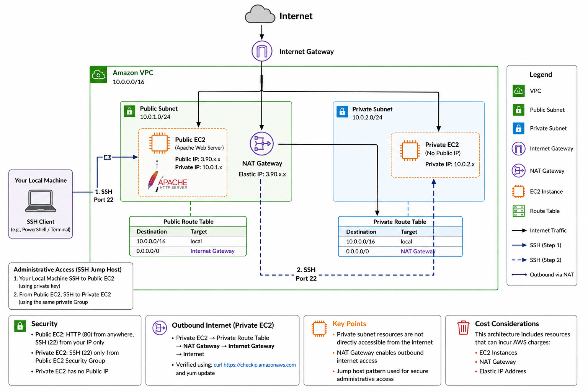

# AWS VPC Infrastructure

Hands-on AWS networking and EC2 infrastructure project demonstrating public/private subnet architecture, routing, controlled access, outbound connectivity, testing and troubleshooting.

> This project was implemented using the AWS CLI in an AWS training environment. The VPC was available in the training environment, while the networking components and EC2 infrastructure documented below were configured and validated as part of this project.

## 🏗️ Architecture




The environment separates internet-facing and private resources using public and private subnets.

```text
                         Internet
                            │
                     Internet Gateway
                            │
              ┌─────────────┴─────────────┐
              │                           │
        Public Subnet               Private Subnet
         10.0.1.0/24                 10.0.2.0/24
              │                           │
        Public EC2                   Private EC2
       Apache Server                No Public IP
              │                           │
              │                      NAT Gateway
              │                           │
              └───────────────────────────┘
````

### Traffic Paths

**Public web traffic**

```text
Internet → Internet Gateway → Public Route Table → Public Subnet → Public EC2
```

**Private outbound traffic**

```text
Private EC2 → Private Route Table → NAT Gateway → Internet Gateway → Internet
```

**Administrative access**

```text
Local Machine → Public EC2 Jump Host → Private EC2
```

The private EC2 instance is not assigned a public IP address.

---

## ☁️ AWS Services & Technologies

* Amazon VPC
* Amazon EC2
* Public and Private Subnets
* Internet Gateway
* NAT Gateway
* Elastic IP
* Route Tables
* Security Groups
* AWS CLI
* Amazon Linux 2023
* Apache HTTP Server
* SSH
* PowerShell

---

## 🌐 Network Design

| Component      | Configuration                  |
| -------------- | ------------------------------ |
| VPC            | `10.0.0.0/16`                  |
| Public Subnet  | `10.0.1.0/24`                  |
| Private Subnet | `10.0.2.0/24`                  |
| Public Route   | `0.0.0.0/0 → Internet Gateway` |
| Private Route  | `0.0.0.0/0 → NAT Gateway`      |
| Public EC2     | Public + private IP            |
| Private EC2    | Private IP only                |

---

## 🔐 Security Design

The environment uses separate security groups for public and private workloads.

### Public EC2

Inbound access:

* HTTP `80` from the internet
* SSH `22` restricted to the administrator's public IP

### Private EC2

Inbound access:

* SSH `22` allowed from the Public EC2 security group
* No direct SSH access from the internet
* No public IP address

The private key is kept on the local machine and is **not copied to the public EC2 jump host**.

---

## 🖥️ Implementation

The infrastructure was configured and tested using the AWS CLI.

Implemented components include:

* Public subnet
* Private subnet
* Internet Gateway
* NAT Gateway
* Elastic IP
* Public route table
* Private route table
* Security groups
* Public EC2 instance
* Private EC2 instance
* Apache web server

Detailed architecture planning is available in [`architecture-plan.md`](architecture-plan.md).

---

## 🧪 Testing & Validation

The infrastructure was validated from multiple perspectives.

### Public Web Server

Apache was installed and started on the public EC2 instance.

HTTP connectivity was successfully tested from the local machine.

### Public EC2 SSH

SSH connectivity from the local machine to the public EC2 instance was successfully validated.

### Private EC2 Access

The private EC2 instance was accessed through the public EC2 instance acting as a jump host.

The connection was established without storing the private SSH key on the public server.

### NAT Gateway

Outbound connectivity from the private EC2 was validated using:

```bash
curl https://checkip.amazonaws.com
```

Amazon Linux repository connectivity was also successfully tested from the private instance.

---

## 🛠️ Troubleshooting

Several real infrastructure issues were encountered and resolved during implementation, including:

* IAM authorization restrictions
* Duplicate security group rules
* Invalid/empty SSH private key
* SSH jump-host configuration
* Private subnet outbound connectivity validation

See [`docs/troubleshooting.md`](docs/troubleshooting.md) for details.

---

## 💰 Cost Considerations

Some resources used in this project can generate AWS charges, particularly:

* NAT Gateway
* Elastic/public IPv4 addresses
* EC2 instances

Resources should be removed when the environment is no longer required.

---

## 🧹 Cleanup

After testing, infrastructure resources should be removed in an appropriate dependency order to avoid unnecessary costs.

Typical cleanup includes:

1. EC2 instances
2. NAT Gateway
3. Elastic IP
4. Route table associations and custom route tables
5. Internet Gateway
6. Subnets
7. Security groups

The training-environment VPC should only be removed if permitted and if it is not required by other lab resources.

---

## 📚 Lessons Learned

This project reinforced several cloud infrastructure concepts:

* Networking configuration determines how EC2 workloads communicate.
* A public subnet requires appropriate routing to an Internet Gateway.
* A private EC2 instance does not require a public IP for outbound internet access.
* NAT Gateway enables outbound connectivity for private workloads.
* Security Groups can reference other Security Groups to control internal access.
* Jump hosts provide a way to administer private infrastructure without directly exposing it.
* AWS authentication does not automatically mean authorization to perform every AWS action.
* Infrastructure should be tested and validated rather than assumed to work after deployment.

---

## 📖 Project Documentation

Detailed project documentation:

- [Architecture Plan](architecture-plan.md)
- [Implementation Guide](docs/implementation.md)
- [Infrastructure Validation](docs/validation.md)
- [Troubleshooting](docs/troubleshooting.md)
- [Cleanup Guide](docs/cleanup.md)
- [Editable Architecture Diagram](assets/aws-vpc-infrastructure.excalidraw)
- [AWS CLI Commands](commands/aws-cli-commands.md)

---
